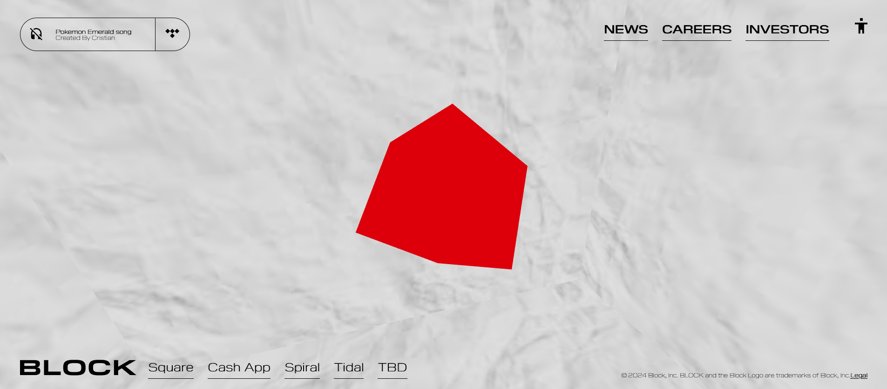

<div align="center">


</div>

<h1 align="center">
  <br>
    <a href="https://github.com/ninpl/README-Template"></a>
      <br>
      README
  <br>
</h1>

<p align="center">
  <a href="https://unity.com/">
    
  </a>
  <a href="https://docs.unity3d.com/2019.4/Documentation/Manual/dotnetProfileSupport.html">
    
  </a>
</p>

## <samp>Configuracion</samp>

Descripción de como usarlo.

```
git clone https://github.com/Cristian-Massa/Block-clone
```

## <samp>Dependencias</samp>

Realizar npm i pra instalarlas

## <samp>Iniciar</samp>

Utilize las siguientes comandos


## <samp>Buildear</samp>
npm run build

## <samp>Desarrollo</samp>
npm run dev

## <samp>Iniciar</samp>
npm run starat


<p align="center">
  
</p>


##‎ <sup><sub><samp>¡HOLA! ¡GRACIAS POR VENIR!</samp></sub></sup>

     
Descripción del proyecto.

<div align="center">

Proyecto realizado para la prueba tecnica de qoop.ai

</div>


